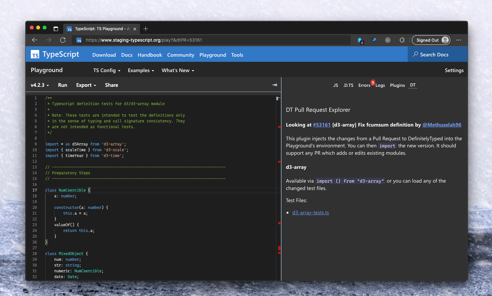

## DT Pull Request Reviewer Plugin

This is a plugin for the TypeScript Playground which makes it easier to review Pull Requests to DefinitelyTyped.

This plugin will install the new version of the types from the PR into the playground, giving you the chance to `import` them and decide if it acts like you think it does.



## Running this plugin

- [Click this link](https://www.typescriptlang.org/play?install-plugin=playground-dt-review) to install

or

- Open up the TypeScript Playground
- Go the "Plugins" in the sidebar
- Look for "Plugins from npm"
- Add "playground-dt-review"
- Reload the browser

Then it will show up as a tab in the sidebar.

## Contributing

See [CONTRIBUTING.md](./CONTRIBUTING.md) for the full details, however, TLDR:

```sh
git clone https://github.com/orta/playground-dt-review.git
cd playground-dt-review
yarn install
yarn start
```

Then tick the box for starting plugin development inside the TypeScript Playground.
